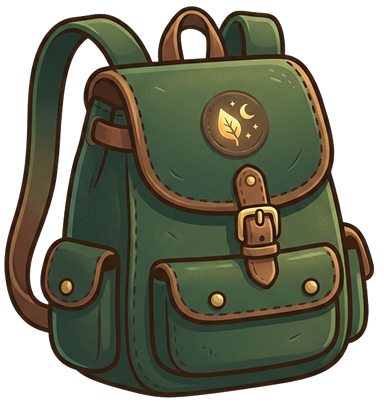

  

# PackAway

### Leave the table. Keep the game.

PackAway is a tiny **save point for tabletop RPG and board game sessions**.

Sometimes a game has to stop before the game is actually over. Pack away the table, go home, and three weeks later nobody remembers exactly what was happening.

PackAway lets you save the state of a session so you can pick it up again later.

## What it saves

- Game and scenario
- Players and their characters
- Stats and scores
- Notes
- What happened
- **What's Next** — the most important part
- An optional photo of the table

## Try PackAway

**[packaway.dev](https://packaway.dev)**

No account. No subscription. No server required for your saves.

PackAway is a local-first Progressive Web App and works offline once installed.

## Features

- Local-first
- Works offline
- Installable as a PWA
- No account required
- Export and import your saves
- Share a formatted session summary
- Optional table/session photo
- Dark, tabletop-friendly interface

## Open source

PackAway is free and open source.

The project is built with:

- React
- TypeScript
- Vite
- Tailwind CSS
- IndexedDB / Dexie
- Vite PWA

No account. No subscription. No cloud save.

If you find PackAway useful, you can leave a small tip on [itch.io](https://itch.io/blog/1667186/packaway-save-and-resume-your-games), [paypal](https://www.paypal.com/paypalme/idolofmanyhands) or [ko-fi](https://ko-fi.com/idolofmanyhands). It's completely optional.

---

This project, including code, design assets, and artwork, is licensed under the **Creative Commons Attribution 4.0 International (CC BY 4.0)** license.

See the [LICENSE](LICENSE) file for the full license text.
